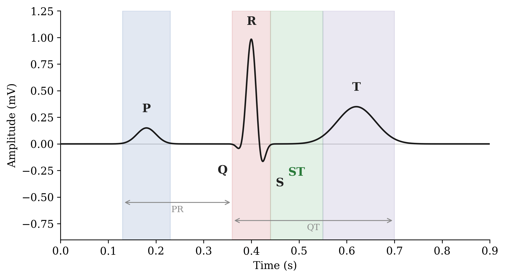
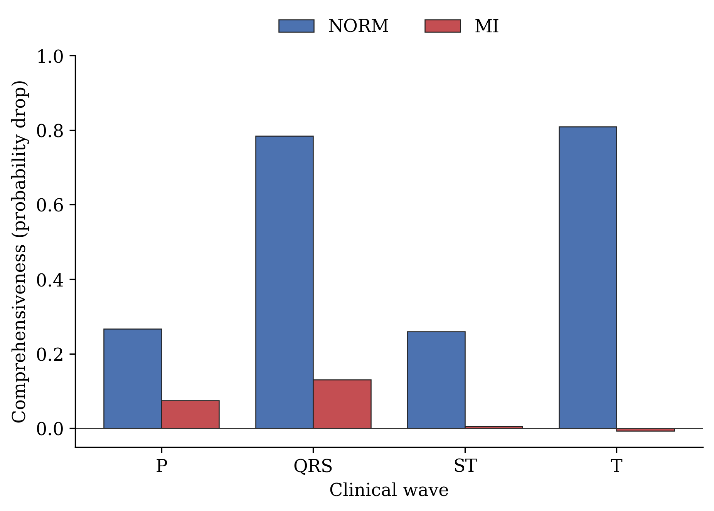

# Post-hoc XAI for ECG

**Reliability of Post-hoc Explanations for Deep ECG Classification: A Faithfulness, Causal, and Stability Evaluation**

MSc Thesis · Data Science · Yeditepe University
Author: Emine Nur Kahraman · Supervisor: Assist. Prof. Onur Demir


---

## Overview

Deep neural networks classify ECGs accurately, but their explanations are rarely
tested for reliability. This project asks whether post-hoc explanation methods —
Integrated Gradients, Grad-CAM, GradientSHAP, and LIME — produce **trustworthy**
explanations when applied to a 1D ECG classifier trained on PTB-XL.

Instead of accepting attribution maps at face value, the work evaluates them
along **four independent axes**:

| Axis | Question | Method |
|------|----------|--------|
| **Clinical alignment** | Which ECG waves do the explanations attend to? | NeuroKit2 wave-overlap framework |
| **Faithfulness** | Do the highlighted regions actually drive the prediction? | Insertion / deletion curves |
| **Causal dependence** | Does the model *causally* depend on those regions? | Wave ablation |
| **Stability** | Are the explanations reproducible across training runs? | 5-seed agreement |

## Key Findings

- **Grad-CAM collapses on ECG** — its ReLU returns an all-zero map for **47%** of recordings (75% of those predicted normal).
- **IG ≈ SHAP ≫ Grad-CAM** in faithfulness (Wilcoxon *p* < 10⁻⁷, Cliff's δ > 0.7); IG and SHAP are statistically indistinguishable.
- **The ST-segment reversal** — the model uses the ST segment to identify *normal* ECGs but **not** myocardial infarction, the reverse of the clinical criterion.
- **Faithful ≠ localizable** — MI is explained faithfully yet depends on no single wave.
- **Explanations are run-dependent** — five models with identical accuracy (0.9337 ± 0.0010) share only **77%** of their most important timepoints.

## Repository Structure

```
post-hoc-xai-ecg/
├── ecg_xai_thesis.ipynb      # complete, self-contained pipeline
├── figures/                  # generated thesis figures
├── requirements.txt          # dependencies
└── README.md
```

The notebook runs end-to-end in chronological order:

1. **Model** — ResNet-18 (1D)
2. **Data** — PTB-XL with patient-wise (`strat_fold`) splitting to prevent leakage
3. **Training** — 20 epochs, weighted loss, augmentation, best-checkpoint selection
4. **Evaluation** — per-class AUC / F1, threshold optimization
5. **XAI engine** — IG, Grad-CAM (ReLU + signed), GradientSHAP, LIME, overlap, faithfulness, ablation
6. **Four-axis analysis** — overlap, faithfulness, agreement, causal ablation
7. **Stability** — 5 training seeds
8. **Model comparison** — six architectures
9. **Figures** — collapse, attribution overlay, insertion/deletion, misclassified example

## Dataset

[PTB-XL](https://physionet.org/content/ptb-xl/) — a large publicly available
12-lead ECG dataset (21,799 recordings, 5 diagnostic superclasses: NORM, MI,
STTC, CD, HYP). The dataset is **not** included in this repository; download it
from PhysioNet and set `data_dir` in the notebook.

## Setup

```bash
git clone https://github.com/nurusta/post-hoc-xai-ecg.git
cd post-hoc-xai-ecg
pip install -r requirements.txt
```

Then open `ecg_xai_thesis.ipynb`, set `data_dir` to your PTB-XL path, and run all
cells. A trained checkpoint (`ecg_optimized_patientwise.pth`) is produced by the
training section and reused by the XAI analyses.

## Requirements

- Python 3.10+
- PyTorch, NumPy, pandas, scikit-learn
- `wfdb` (ECG I/O), `neurokit2` (wave delineation)
- `captum` (Integrated Gradients), `shap`, `lime`
- matplotlib, scipy

Install with `pip install -r requirements.txt`.

## Selected Figures

| ECG wave anatomy | Grad-CAM collapse | ST-segment reversal |
|:---:|:---:|:---:|
|  | *(generated in notebook)* |  |

## Citation

If you use this work, please cite:

```bibtex
@mastersthesis{kahraman2026ecgxai,
  title  = {Reliability of Post-hoc Explanations for Deep ECG Classification:
            A Faithfulness, Causal, and Stability Evaluation},
  author = {Kahraman, Emine Nur},
  school = {Yeditepe University},
  year   = {2026}
}
```

## License

Released under the **GNU General Public License v3.0** (GPLv3) — see the
[LICENSE](LICENSE) file. PTB-XL is distributed separately under its own license
(Creative Commons Attribution 4.0).
